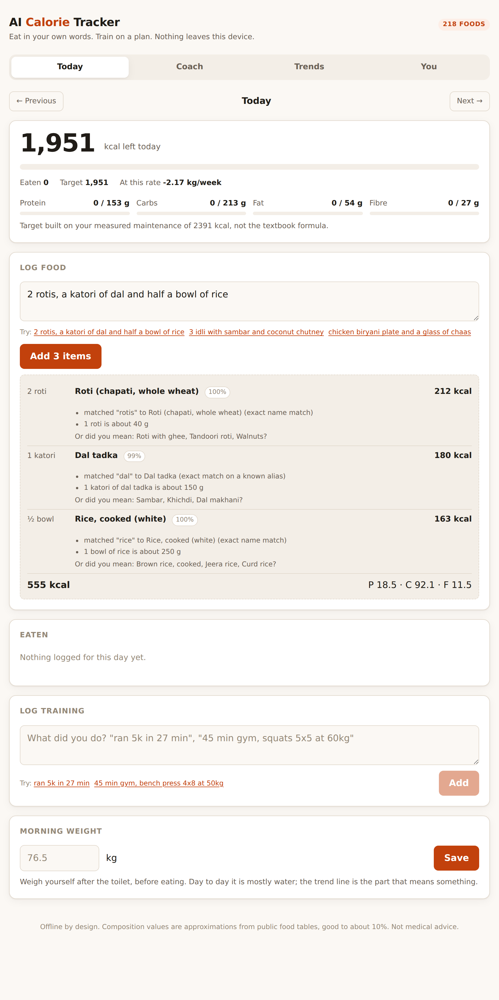
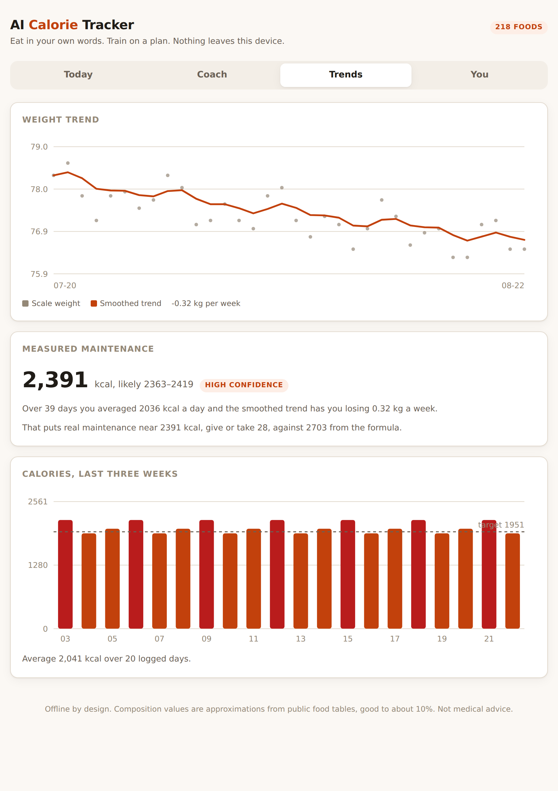
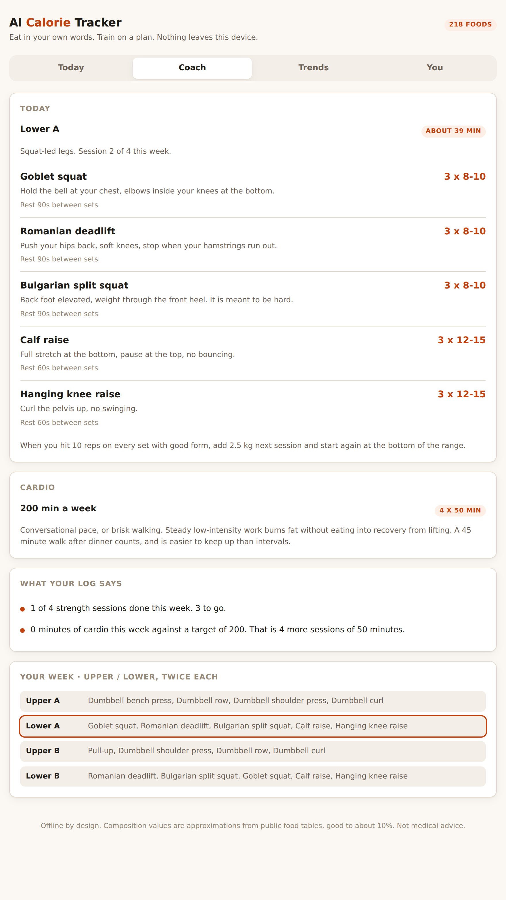

# AI Calorie Tracker

**Type what you ate. In your own words. Including the words you actually use.**

> "2 rotis, a katori of dal and half a bowl of rice"

```
  ✓ 2 roti         Roti (chapati, whole wheat)          80g   212 kcal
  ✓ 1 katori       Dal tadka                           150g   180 kcal
  ✓ ½ bowl         Rice, cooked (white)                125g   163 kcal

  555 kcal   protein 18.5 g · carbs 92.1 g · fat 11.5 g · fibre 9 g
```

A calorie and fitness tracker built around **Indian food first** and everything
else second, that runs **entirely in your browser**. No account, no server, no
API key, no network call. It also tells you what to train today, and it works
out your real maintenance calories from your own log instead of trusting a
formula.

🔗 **Live:** https://zzzzzryanzzzzzz.github.io/ai-calorie-tracker/



---

## Why this exists

Every calorie app is a search box over an American database. Logging an Indian
meal in one means turning "dal chawal" into a search for "lentil curry", picking
one of forty crowd-sourced entries of unknown provenance, then converting a
katori into grams by feel. It is enough friction that most people log for a week
and stop.

Three things follow from taking that seriously:

**The database is Indian-first.** 218 foods, over half of them Indian, stored as
they are eaten — a curry with the oil already in it, because that is the only
weight anyone can estimate. It knows a katori of dal is about 150 g, that one
roti is 40 g and one idli is 45 g, and that "chole bhature" is a katori of chole
and two bhature rather than a single mystery entry.

**The input is a sentence, not a search box.** You write what you ate. The app
works out the amounts, the units and the foods, and then **shows you exactly how
it read every word** so you can correct it in one click instead of trusting it.

**Nothing leaves the device.** A food diary is one of the more personal things a
person keeps. This one is stored in your browser's localStorage and nowhere
else, which is why it needs no account and no privacy policy.

---

## What it does

### Reads how people actually write

| You type | It understands |
| --- | --- |
| `2 rotis, a katori of dal and half a bowl of rice` | three dishes, 80 g / 150 g / 125 g |
| `daal chawal` | a katori of dal **and** a katori of rice |
| `veg thali` | roti, dal, sabzi, rice, curd, papad, pickle |
| `palak paner` | Palak paneer — the spelling does not matter |
| `aaj maine 2 chapati khai` | 2 rotis; the words it does not know are ignored |
| `chicken 65` | one serving of Chicken 65, not sixty-five chickens |
| `200g chicken breast` | exactly 200 g |
| `1 large paratha` | a paratha, scaled up by a third |

There is no language model here and nothing is sent anywhere. It is an amount
parser, a portion table and a fuzzy name matcher, which between them cover the
way people write down food. The matcher folds spelling variants that only exist
because of transliteration — dal/daal/dhal, chana/channa, roti/rotti all reduce
to the same skeleton before comparison — so an Indian food table stops needing
forty aliases per row.

### Shows its working

Every row explains itself: which words matched, which entry they matched, the
portion weight used, and every assumption made along the way. When it is unsure
it says so with a confidence figure and offers the runners-up. When it does not
recognise something it says that instead of quietly inventing calories.

### Measures your maintenance instead of guessing it

Mifflin-St Jeor times an activity multiplier is a guess, and the multiplier is
the worst part of it — "moderately active" means different things to different
people. But anyone logging weight and food for a few weeks is already running
the experiment that settles it:

```
maintenance = mean intake − (rate of weight change × 7700 kcal/kg)
```

The catch is that scale weight swings by a kilo from water and salt alone. So
the app smooths the weight series with an exponentially weighted moving average,
fits the trend by least squares, and reports the answer **with a confidence
interval**, blending it with the formula in proportion to how much data exists.



In the screenshot the formula says 2703 kcal. The person's own log says 2391,
give or take 28. That 312 kcal gap is the difference between losing weight and
wondering why you are not.

It also refuses to fool you in the other direction: if the arithmetic comes out
**below your resting metabolism**, that is not a slow metabolism, it is food
going unlogged — the oil, the sugar in the chai, the bite eaten standing up. The
app says so and keeps using the formula until the log adds up.

### Tells you what to train



Sessions are built pattern-first, not exercise-first: a workout asks for a
squat, a hinge, a horizontal push, and the best movement you can actually do
gets filled in from the equipment you have. The same plan works in a gym and in
a bedroom. If a pattern is impossible — there is no vertical pull without a bar
— it substitutes rather than silently dropping your back from the programme.

- **Splits** from 2 to 6 days a week, picked from how often you will train.
- **Sets and reps** from your goal: heavier and lower for a bulk, more volume and
  shorter rests for a cut.
- **Cardio** dosed to the goal, with the reasoning stated.
- **Progression**: hit the top of the rep range on every set, add weight. That is
  the only rule that reliably works, so it is the only one given.
- **It reads your log** and says what you are avoiding: no strength work this
  week, nothing that looks like leg work in a fortnight, seven days without a
  rest day.

The rotation advances by what you have logged, not by the calendar, so a missed
Tuesday shifts the week rather than losing a session.

### Honest arithmetic on training burn

Running is not one number. Costing a run at a flat MET makes a 7 km/h jog and a
14 km/h run identical, so pace is read from the log and the MET interpolated
from the speed bands in the Compendium of Physical Activities.

And the calories credited back are **net**, not gross: an hour of cycling
replaces an hour of sitting, and the resting part of it is already inside your
daily budget. Counting it twice is the most common way a tracker flatters you.

---

## Running it

```bash
git clone https://github.com/ZzzzzRyanzzzzzZ/ai-calorie-tracker.git
cd ai-calorie-tracker
npm install
npm run dev
```

Then open the printed URL. Everything is client-side; there is nothing else to
start.

```bash
npm test         # 86 tests
npm run build    # production bundle into dist/
npm run typecheck
```

### The command line

The same engine, without a browser. Node strips the types on the way in, so
there is no build step and no dependencies.

```bash
node bin/track.js "3 idli with sambar and coconut chutney"
node bin/track.js --train "ran 5k in 27 min" --weight 72
node bin/track.js --coach --goal gain --days 4 --equipment dumbbells,pullup-bar
node bin/track.js --list paneer
node bin/track.js "2 samosa and chai" --why     # every assumption, spelled out
```

---

## How it is put together

```
src/
  core/
    text.ts          Normalisation, and the transliteration fold that makes
                     dal/daal/dhal the same word
    units.ts         Amounts: fractions, "half a", 200g, katori, plate, peg
    match.ts         Fuzzy name matching with an explanation attached
    parseFood.ts     Sentence -> food rows, including combo meals like thali
    parseExercise.ts Training -> minutes, METs and net calories
    energy.ts        BMR, TDEE, targets, macro split
    adaptive.ts      Measuring real maintenance from weight and intake
    coach.ts         What to train today, and what you have been avoiding
    store.ts         localStorage, export, import
  data/
    foods.ts         218 foods, per 100 g as eaten
    exercises.ts     METs, with speed bands for paced activities
    workouts.ts      Movements by pattern, splits by training days
  ui/                The web app: vanilla TypeScript, no framework
  cli/               The terminal front end
```

No runtime dependencies. TypeScript, Vite and Vitest are the only dev ones.

### The tests are the interesting part

86 of them, and several are checks on the data rather than the code. One
recomputes every food's energy from its own macros using Atwater factors and
fails if any row disagrees by more than a quarter — which is how you catch a
typo in 218 hand-entered rows. Another feeds the maintenance estimator a
synthetic log with realistic water-weight noise and asserts it recovers the true
maintenance calories that generated it.

---

## Honest limits

- **Composition values are approximations**, from IFCT and USDA tables and from
  typical home recipes where a dish has no official entry. Good to about ±10%,
  which is well inside the error of guessing a portion by eye anyway.
- **Restaurant food is underestimated by everyone**, including this app. A
  restaurant paneer dish carries far more oil and cream than a home one.
- **Portion sizes are the real error term.** Not the database, not the parser.
  Weighing your rice for one week teaches you more than any tracker will.
- **The maintenance estimate needs about two weeks** of near-daily weights and
  honest logging before it beats the formula. It says so until then.
- Not medical advice. If you have a condition that makes any of this matter
  medically, talk to a doctor rather than a static web page.

---

## Licence

MIT. See [LICENSE](LICENSE).
